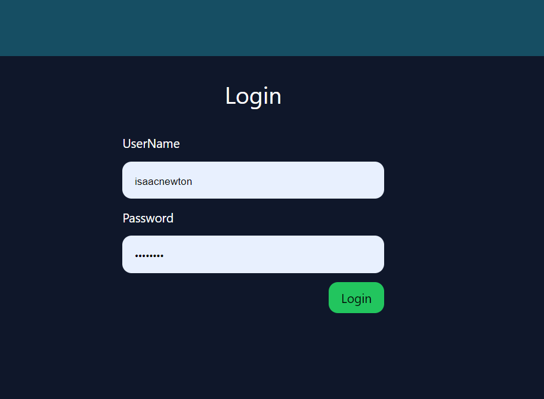
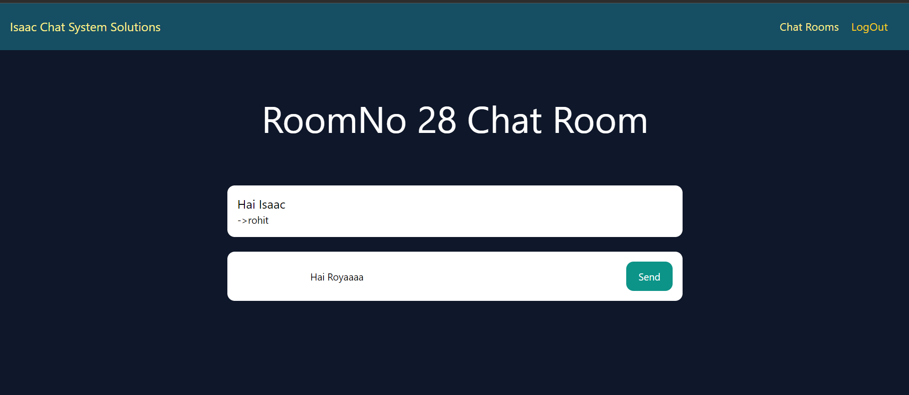

ChatApplication Built with Django & TailWind CSS 
 

With this Application you will be able to create chat rooms from the Django admin panel
 
 

And to accsess that you have to login to the application
username: Newton
Password : Newton

 --->

 
 

This is the apps HomePage : 
 

 

All Chat Rooms 
 

 
<strong>If you want to install this to your local Environment i have given the Requirements.txt just install those and dont forget that migrate as well then we are done</strong>
Chatting:
 

 

<i>Note : This is not online chat application instead chatting in the local environment <i>

if you Want you can configure to be Deployment and need any help contact me : https://webdevisaac.com

Made with 💞 Isaac

